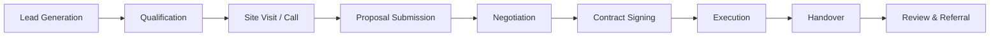

# **WOODEX INTERIOR – MASTER BUSINESS RELAUNCH PLAN**

**Version:** 3.0 | **Date:** September 2026 | **Prepared by:** Black Ibex Design Agency
**Classification:** Internal – Confidential | **Target Domain:** [woodex.com.pk](https://woodex.com.pk)

---

---

---

---

# **📌 TABLE OF CONTENTS**

1. **[Executive Summary](#executive-summary)**
2. **[About Woodex Interior](#about-woodex-interior)**
   - Company Profile
   - Vision, Mission & Values
   - Founder & Leadership
   - Milestones & Achievements
3. **[Services Architecture](#services-architecture)** *(Sorted & Prioritized)*
   - Core Service Lines
   - Service Definitions & Deliverables
   - Pricing Strategy
4. **[Market Analysis](#market-analysis)**
   - Industry Overview (Pakistan)
   - Target Market Segmentation
   - Competitive Landscape
   - SWOT Analysis
5. **[Business Model & Revenue Streams](#business-model--revenue-streams)**
6. **[Marketing & Sales Strategy](#marketing--sales-strategy)**
   - Brand Positioning
   - Digital Marketing Plan
   - Lead Generation & Conversion
   - Sales Process
7. **[Operations & Delivery Model](#operations--delivery-model)**
   - Project Workflow
   - Team Structure
   - Vendor & Supplier Management
8. **[Financial Plan](#financial-plan)**
   - Revenue Projections (5 Years)
   - Cost Structure
   - Break-Even Analysis
   - Funding Requirements
9. **[Risk Management](#risk-management)**
10. **[Implementation Timeline](#implementation-timeline)**
11. **[Appendices](#appendices)**

---

---

---

# **🚀 1. EXECUTIVE SUMMARY**

**Woodex Interior** is a **Lahore-based design and build company** established in **2016** by **Imtiaz Ahmad**, specializing in **interior design, fit-out, renovation, and turnkey solutions** for **corporate offices, commercial spaces, retail environments, healthcare facilities, restaurants, cafés, and premium residential projects** across Pakistan.

With **200–500 completed projects** over a decade, Woodex has built a reputation for **reliable execution, in-house 3D visualization, and a sister brand (WOODEX FURNITURE™)** that supplies custom joinery, kitchens, and wardrobes. The company operates from its **head office at M-71, Zainab Tower, Model Town Link Road, Lahore**, with **delivery capabilities in Islamabad, Karachi, and nationwide**.

### **🎯 Relaunch Objective**

This **Master Business Relauch Plan** aims to:
✅ **Professionalize** Woodex’s brand, digital presence, and sales systems.
✅ **Clarify** service offerings (eliminating overlap between **Fit-Out vs. Renovation vs. Turnkey**).
✅ **Scale** operations with a **structured lead generation, conversion, and delivery model**.
✅ **Leverage** the **WOODEX FURNITURE™** e-commerce brand as a **revenue multiplier**.
✅ **Achieve Year-1 revenue of PKR 50M–150M** (Base Case: **PKR 90M**).

### **💡 Key Differentiators**

| **Factor**           | **Woodex Advantage**                                        |
| -------------------- | ----------------------------------------------------------- |
| **Experience**       | 10+ years, 200–500 projects                                 |
| **Service Range**    | Design → Build → Furniture (End-to-End)                     |
| **Geographic Reach** | Lahore HQ + Islamabad, Karachi, Nationwide                  |
| **Technology**       | In-house **AutoCAD, 3ds Max, 3D Studio**                    |
| **Sister Brand**     | **WOODEX FURNITURE™** (Custom Kitchens, Wardrobes, Joinery) |
| **Warranty**         | **12-month workmanship guarantee**                          |
| **Specialization**   | **Pharmacy, Petro, Co-Working, Retail Rollouts**            |

### **📊 Financial Snapshot (Year-1 Base Case)**

| **Metric**               | **Value**                         |
| ------------------------ | --------------------------------- |
| **Revenue Target**       | PKR **90M**                       |
| **Gross Margin**         | **22–28%**                        |
| **Net Profit (EBITDA)**  | **PKR 8–11M**                     |
| **Average Project Size** | PKR **2.5M–5M**                   |
| **Lead Target**          | **40+ qualified enquiries/month** |
| **Close Rate**           | **12–18%**                        |

**🔹 Next Phase:** *This plan is structured to first define **Who We Are** (About) and **What We Do** (Services), then expand into **How We Win** (Market, Strategy, Operations, Finances).*

---

---

---

# **🏢 2. ABOUT WOODEX INTERIOR**

---

## **📜 2.1 Company Profile**

### **🏛️ Legal & Operational Details**

| **Detail**            | **Information**                                                                                                                                              |
| --------------------- | ------------------------------------------------------------------------------------------------------------------------------------------------------------ |
| **Company Name**      | Woodex Interior                                                                                                                                              |
| **Founded**           | 2016                                                                                                                                                         |
| **Founder & CEO**     | Imtiaz Ahmad                                                                                                                                                 |
| **Head Office**       | **Office M-71, Zainab Tower, Model Town Link Road, Lahore**                                                                                                  |
| **Google Maps Link**  | [maps.app.goo.gl/uTvkAzYCA2maRqfP8](https://maps.app.goo.gl/uTvkAzYCA2maRqfP8)                                                                               |
| **Website**           | [woodex.com.pk](https://woodex.com.pk)                                                                                                                       |
| **Sister Brand**      | **WOODEX FURNITURE™** ([woodexfurniture.pk](https://woodexfurniture.pk))                                                                                     |
| **Operating Cities**  | Lahore (HQ), Islamabad, Karachi (Delivery Desks)                                                                                                             |
| **Project Reach**     | **Nationwide** (Peshawar, Multan, Faisalabad, Quetta, etc.)                                                                                                  |
| **Industries Served** | Corporate Offices, Petro Companies, Pharmacies, Co-Working Spaces, Retail, F&B (Restaurants/Cafés), Healthcare (Clinics/Labs), Residential (5 Marla–2 Kanal) |
| **Tools & Software**  | AutoCAD, 3ds Max, Revit (if applicable), Adobe Suite, Project Management Tools                                                                               |
| **Team Strength**     | **18–28** (Designers, Draughtsmen, 3D Visualizers, Architects, Site Supervisors, QS, PM, Procurement, Admin)                                                 |

---

## **🎯 2.2 Vision, Mission & Values**

### **🌟 Vision**

> *"To be Pakistan’s most trusted **design-and-build partner** for offices, commercial spaces, and premium homes—known for **precision, accountability, and craftsmanship** that lasts."*

### **🎯 Mission**

> *"We **design, build, and hand over** functional, elegant spaces that **enhance business success and modern living**. Through **in-house expertise, transparent processes, and a furniture brand that delivers on promises**, we turn concepts into reality—**on time, on budget, and on brand**."*

### **✨ Core Values**

1. **Precision** – Every measurement, every detail, every finish matters.
2. **Accountability** – One team, one contract, one snag list.
3. **Craftsmanship** – Quality that lasts, not just looks good in 3D.
4. **Transparency** – Clear BOQs, no hidden costs, no surprises.
5. **Innovation** – Using technology (3D, BIM) to solve real problems.
6. **Client-Centric** – Your space, your vision, our expertise.
   
   

**Vision** (your version is ambitious; keep, but support with real awards/proof later):

> “To become Pakistan’s most trusted and recognized interior design and fit-out company — setting the standard for design excellence, reliable project delivery and client satisfaction nationwide

---

## **👨‍💼 2.3 Founder & Leadership**

### **Imtiaz Ahmad – Founder & CEO**

- **Experience:** 10+ years in **interior design, fit-out, and construction**.

- **Role:** Oversees **strategy, client relationships, and major commercial bids**.

- **Strengths:**
  
  - Hands-on **site knowledge** (understands execution challenges).
  - Strong **B2B network** (Petro, Pharmacy, Corporate sectors).
  - **Design authority** on high-value projects.

- **LinkedIn:** *(To be added)*

- **Quote:**
  
  > *"We don’t just design spaces—we build trust. A decade on the ground means we’ve seen every problem before and know how to fix it."*

### **Leadership Team (Year-1 Structure)**

| **Role**                        | **Responsibilities**                                     | **Reporting To** |
| ------------------------------- | -------------------------------------------------------- | ---------------- |
| **Head of Design**              | Interior/Architecture design, 3D, client briefs          | Founder          |
| **Architect (PCATP Certified)** | Authority submissions, structural coordination           | Head of Design   |
| **Interior Designers (2–3)**    | Space planning, material selection, client presentations | Head of Design   |
| **Draughtsmen (2)**             | AutoCAD drawings, construction documents                 | Head of Design   |
| **3D Visualizers (1–2)**        | 3ds Max, renderings, walkthroughs                        | Head of Design   |
| **Quantity Surveyor (QS)**      | BOQs, cost estimation, vendor negotiations               | Founder          |
| **Project Managers (2–3)**      | Site coordination, programme management, snagging        | Founder          |
| **Site Supervisors**            | Day-to-day execution, quality control                    | Project Managers |
| **Procurement Manager**         | Material sourcing, vendor contracts                      | QS               |
| **Marketing Coordinator**       | Digital marketing, SEO, social media, lead tracking      | Founder          |
| **Admin/Finance**               | Invoicing, payments, compliance                          | Founder          |

---

## **🏆 2.4 Milestones & Achievements**

| **Year**            | **Milestone**                                                                  |
| ------------------- | ------------------------------------------------------------------------------ |
| **2016**            | Founded by Imtiaz Ahmad in Lahore.                                             |
| **2017–2019**       | Completed **50+ projects** (Offices, Retail, Residential).                     |
| **2020**            | Expanded to **Islamabad & Karachi** (Delivery Model).                          |
| **2021**            | Launched **WOODEX FURNITURE™** (Custom Kitchens, Wardrobes, Joinery).          |
| **2022**            | Delivered **first pharmacy chain rollout** (Prototype + Repeatable Fit-Out).   |
| **2023**            | **200+ projects** completed; **Petro & Corporate sectors** became key clients. |
| **2024**            | **Nationwide project delivery** (Multan, Faisalabad, Peshawar).                |
| **2025**            | **500+ projects** mark; **WOODEX FURNITURE™ e-commerce** went live.            |
| **2026 (Relaunch)** | **Brand refresh, digital overhaul, structured sales process**.                 |

---

---

---

# **🛠️ 3. SERVICES ARCHITECTURE** *(Sorted & Prioritized)*

> **🔹 Note:** *This section is the **core of the business plan**—defining **what we sell, how we sell it, and to whom**. It is **sorted by revenue priority and demand**.*

---

## **📌 3.1 Service Categories (Hierarchy)**

```mermaid
graph TD
    A[WOODEX INTERIOR] --> B[Design Services]
    A --> C[Execution Services]
    A --> D[Product Services]
    A --> E[Delivery Models]

    B --> B1[Interior Design]
    B --> B2[Architecture]
    B --> B3[3D Visualization]

    C --> C1[Fit-Out]
    C --> C2[Renovation]
    C --> C3[Refurbishment]

    D --> D1[WOODEX FURNITURE™]
    D --> D2[FF&E Procurement]

    E --> E1[Turnkey]
    E --> E2[Project Management (PMC)]
    E --> E3[Site Supervision]
```

---

## **🏗️ 3.2 Core Service Lines (Sorted by Revenue Priority)**

| **#**  | **Service Line**                                     | **Target Market**            | **Avg. Ticket Size (PKR)** | **Margin %** | **Priority (1–5)** | **Key Selling Points**                                       |
| ------ | ---------------------------------------------------- | ---------------------------- | -------------------------- | ------------ | ------------------ | ------------------------------------------------------------ |
| **1**  | **Office Fit-Out (Turnkey)**                         | Corporate, Petro, Co-Working | 5M–20M                     | 22–25%       | ⭐⭐⭐⭐⭐              | **#1 Revenue Driver** – Repeatable, scalable, high-margin    |
| **2**  | **Pharmacy Fit-Out & Renovation**                    | Pharmacy Chains, Clinics     | 3M–10M                     | 24–28%       | ⭐⭐⭐⭐⭐              | **Niche Specialization** – Less competition, chain potential |
| **3**  | **Retail & Showroom Fit-Out**                        | Brand Stores, Shops          | 4M–12M                     | 20–25%       | ⭐⭐⭐⭐               | **Brand Rollouts** – Prototype-based, fast execution         |
| **4**  | **Restaurant & Café Fit-Out**                        | F&B Chains, Independent      | 6M–15M                     | 18–22%       | ⭐⭐⭐⭐               | **High-Visibility Projects** – Marketing gold                |
| **5**  | **Corporate Interior Design**                        | Offices, Workplaces          | 1M–5M (Design Fee)         | 55–75%       | ⭐⭐⭐⭐               | **High-Margin** – Leads to execution                         |
| **6**  | **Residential Interior Design (1–2 Kanal)**          | Homeowners                   | 2M–8M (Design + Build)     | 25–30%       | ⭐⭐⭐                | **Brand Building** – Instagram & SEO                         |
| **7**  | **Healthcare Fit-Out (Clinics, Labs)**               | Hospitals, Diagnostics       | 4M–12M                     | 22–26%       | ⭐⭐⭐                | **Specialized Compliance** – Cleanability, durability        |
| **8**  | **Office Renovation**                                | Existing Offices             | 3M–10M                     | 20–24%       | ⭐⭐⭐                | **Phased Work** – Minimal downtime                           |
| **9**  | **Home Renovation**                                  | Villas, Apartments           | 2M–6M                      | 25–30%       | ⭐⭐                 | **Recurring Clients** – Furniture attach                     |
| **10** | **Architecture (Residential/Commercial)**            | Homeowners, Developers       | 500K–3M                    | 40–60%       | ⭐⭐                 | **Authority Submissions** – PCATP compliance                 |
| **11** | **3D Studio (Rendering, Walkthroughs)**              | Architects, Developers       | 100K–500K                  | 60–70%       | ⭐⭐                 | **High-Margin Add-On** – External clients                    |
| **12** | **WOODEX FURNITURE™ (Kitchens, Wardrobes, Joinery)** | Homeowners, Offices          | 500K–5M                    | 30–40%       | ⭐⭐⭐⭐               | **Recurring Revenue** – Attach to every project              |

---

## **📋 3.3 Service Definitions & Deliverables**

### **🔹 1. Office Fit-Out (Turnkey)**

**Definition:**

> *Construction of a **new or bare shell space** into a fully functional office, including partitions, ceilings, flooring, MEP, joinery, and furniture.*

**Includes:**
✅ Space Planning & Interior Design
✅ AutoCAD & 3D Visualization
✅ Partitions (Gypsum, Glass, Wood)
✅ Ceilings (False, Grid, Acoustic)
✅ Flooring (Tiles, Vinyl, Wood, Carpet)
✅ Electrical & Lighting (4000K LED, Emergency)
✅ HVAC Coordination
✅ Joinery (Reception, Cabins, Workstations)
✅ Furniture (WOODEX FURNITURE™)
✅ Branding & Signage
✅ Snagging & Handover

**Excludes:**
❌ Civil/Grey Structure
❌ Structural Changes (unless pre-approved)
❌ Client-Supplied Materials (unless specified)

**Typical Programme:**

- **Design Phase:** 2–4 weeks
- **Execution Phase:** 6–12 weeks (depending on size)
- **Handover:** 1 week (Snagging & Final Touches)

**Target Clients:**

- Corporate Offices (MNCs, Local Conglomerates)
- **Petro Companies** (Shell, Total, PSO)
- Software Houses & IT Firms
- **Co-Working Spaces** (WeWork-style)
- Banks & Financial Institutions

**Pricing (Lahore, 2026):**
| **Spec Level** | **PKR/Sq.Ft.** | **Example (2,000 Sq.Ft.)** |
|---------------|---------------|-----------------------------|
| **Basic** | 4,500–6,000 | **9M–12M** |
| **Mid-Spec** | 6,000–8,000 | **12M–16M** |
| **Premium** | 8,000–14,000 | **16M–28M** |

---

### **🔹 2. Pharmacy Fit-Out & Renovation**

**Definition:**

> *Specialized fit-out and renovation for **pharmacies, clinics, and labs**, focusing on **dispensing efficiency, storage, and compliance**.*

**Includes:**
✅ **Dispensing Counter Design** (L-Shaped, U-Shaped, Island)
✅ **Storage Solutions** (Controlled Drugs, Refrigeration)
✅ **Lighting** (4000K–5000K, No Glare on Medication)
✅ **Flooring** (Anti-Slip, Easy to Clean)
✅ **Wall Finishes** (Washable, Antibacterial Paint)
✅ **HVAC** (Temperature-Controlled for Medication)
✅ **Signage & Branding** (Pharmacy Licensing Compliance)
✅ **Security Systems** (Cameras, Alarms)

**Why Woodex?**

- **Prototype-Based Approach** (Same design for chain rollouts)
- **Fast Turnaround** (Minimize downtime)
- **Compliance Knowledge** (Pharmacy licensing requirements)

**Pricing:**
| **Type** | **PKR/Sq.Ft.** | **Example (1,000 Sq.Ft.)** |
|----------|---------------|-----------------------------|
| **Basic Pharmacy** | 5,500–7,000 | **5.5M–7M** |
| **Mid-Spec Pharmacy** | 7,000–9,000 | **7M–9M** |
| **Premium Pharmacy (Chain Rollout)** | 9,000–12,000 | **9M–12M** |

**Target Clients:**

- **Pharmacy Chains** (Servaid, Ferozsons, Independent Chains)
- **Hospitals & Clinics**
- **Laboratories & Diagnostic Centers**

---

### **🔹 3. Retail & Showroom Fit-Out**

**Definition:**

> *Brand-aligned fit-out for **shops, showrooms, and retail environments**, focusing on **customer experience and product display**.*

**Includes:**
✅ **Space Planning** (Customer Flow, Product Zones)
✅ **Shopfront & Entrance Design**
✅ **Display Units & Shelving** (WOODEX FURNITURE™)
✅ **Lighting** (Spotlights, Track Lighting, Ambient)
✅ **Flooring** (Vinyl, Tiles, Wood-Look)
✅ **Ceilings** (Feature Ceilings, Backlit Panels)
✅ **Branding & Graphics** (Wall Murals, Logo Applications)
✅ **Storage & Back-of-House**

**Why Woodex?**

- **Brand Rollout Expertise** (Same design for multiple locations)
- **Fast Execution** (Minimize revenue loss during fit-out)
- **Material Knowledge** (Durable, low-maintenance finishes)

**Pricing:**
| **Type** | **PKR/Sq.Ft.** | **Example (1,500 Sq.Ft.)** |
|----------|---------------|-----------------------------|
| **Basic Retail** | 5,000–7,000 | **7.5M–10.5M** |
| **Mid-Spec Retail** | 7,000–9,000 | **10.5M–13.5M** |
| **Luxury Showroom** | 10,000–15,000 | **15M–22.5M** |

**Target Clients:**

- **Brand Stores** (Local & International Brands)
- **Showrooms** (Automotive, Furniture, Electronics)
- **Boutiques & Flagship Stores**

---

### **🔹 4. Restaurant & Café Fit-Out**

**Definition:**

> *Specialized fit-out for **F&B establishments**, focusing on **kitchen efficiency, customer experience, and durability**.*

**Includes:**
✅ **Kitchen Layout & Equipment Coordination**
✅ **Dining Area Design** (Seating, Bar, Lounge)
✅ **Lighting** (Ambient, Task, Decorative)
✅ **Flooring** (Anti-Slip, Easy to Clean)
✅ **Ceilings** (Acoustic, Fire-Rated)
✅ **Joinery** (Bar Counters, Display Units)
✅ **Ventilation & Exhaust** (Kitchen Hoods, Ducting)
✅ **Plumbing & Wet Areas**

**Why Woodex?**

- **Kitchen Workflow Expertise** (Chef Consultations)
- **Durable Materials** (Stainless Steel, Quartz, High-Pressure Laminates)
- **Fast Turnaround** (Minimize lost revenue)

**Pricing:**
| **Type** | **PKR/Sq.Ft.** | **Example (2,000 Sq.Ft.)** |
|----------|---------------|-----------------------------|
| **Basic Café** | 7,000–9,000 | **14M–18M** |
| **Mid-Spec Restaurant** | 9,000–12,000 | **18M–24M** |
| **Premium Restaurant** | 12,000–16,000 | **24M–32M** |

**Target Clients:**

- **Cafés & Coffee Shops** (Local Chains, International Brands)
- **Fine Dining Restaurants**
- **Fast Food & QSR (Quick Service Restaurants)**
- **Cloud Kitchens** (Delivery-Focused)

---

### **🔹 5. Corporate Interior Design**

**Definition:**

> *Design-only service for **offices, workplaces, and commercial spaces**, focusing on **space planning, aesthetics, and functionality**.*

**Includes:**
✅ **Space Planning & Layouts**
✅ **Mood Boards & Material Selection**
✅ **3D Visualization (3ds Max, Lumion)**
✅ **Furniture & Finishes Specification**
✅ **Lighting & Electrical Layouts**
✅ **BOQ (Bill of Quantities) for Execution**

**Excludes:**
❌ Construction/Execution (unless **Turnkey** is selected)

**Pricing:**
| **Scope** | **Fee Structure** | **Example (5,000 Sq.Ft. Office)** |
|-----------|------------------|-----------------------------------|
| **Basic Design Package** | PKR 80–120/Sq.Ft. | **400K–600K** |
| **Full Design Package** | PKR 120–180/Sq.Ft. | **600K–900K** |
| **Luxury/High-End** | PKR 180–250/Sq.Ft. | **900K–1.25M** |

**Target Clients:**

- **Corporate Clients** (Who want design-only before execution)
- **Architects & Developers** (Need interior design support)
- **Homeowners** (Design-first approach)

---

---

### **🔹 6. Residential Interior Design (1–2 Kanal)**

**Definition:**

> *Full interior design for **premium homes (5 Marla–2 Kanal)**, including **kitchens, wardrobes, living spaces, and custom joinery**.*

**Includes:**
✅ **Space Planning** (Living, Dining, Bedrooms, Kitchen)
✅ **3D Visualization** (Photorealistic Renders)
✅ **Material & Finish Selection**
✅ **Furniture & Joinery Design** (WOODEX FURNITURE™)
✅ **Lighting & Electrical Layouts**
✅ **BOQ for Execution**

**Why Woodex?**

- **Custom Joinery** (Kitchens, Wardrobes, Media Walls)
- **Functional Design** (Storage, Workflow, Aesthetics)
- **End-to-End Service** (Design → Build → Furniture)

**Pricing:**
| **Scope** | **Fee Structure** | **Example (1 Kanal House)** |
|-----------|------------------|-----------------------------|
| **Design Only** | PKR 100–150/Sq.Ft. | **1M–1.5M** |
| **Design + Build** | PKR 3,500–7,000/Sq.Ft. | **10M–20M** |
| **Luxury (2 Kanal+)** | PKR 7,000–15,000/Sq.Ft. | **20M–40M** |

**Target Clients:**

- **Homeowners** (DHA, Bahria, Gulberg, Model Town)
- **Investors** (Rental Properties, Flipping)
- **NRI Clients** (Overseas Pakistanis)

---

---

### **🔹 7. Healthcare Fit-Out (Clinics, Labs)**

**Definition:**

> *Specialized fit-out for **clinics, labs, and healthcare facilities**, focusing on **hygiene, compliance, and workflow efficiency**.*

**Includes:**
✅ **Reception & Waiting Area Design**
✅ **Consultation Rooms**
✅ **Diagnostic Labs** (Pathology, Radiology)
✅ **Cleanable Finishes** (Antibacterial Paint, Vinyl Flooring)
✅ **Lighting** (5000K, No Shadows)
✅ **HVAC** (Negative Pressure for Labs)
✅ **Plumbing & Wet Areas** (Sinks, Handwashing Stations)
✅ **Storage for Medical Supplies**

**Why Woodex?**

- **Compliance Knowledge** (Healthcare Regulations)
- **Durable & Hygienic Materials**
- **Fast Execution** (Minimize downtime for clinics)

**Pricing:**
| **Type** | **PKR/Sq.Ft.** | **Example (1,500 Sq.Ft. Clinic)** |
|----------|---------------|-----------------------------------|
| **Basic Clinic** | 6,000–8,000 | **9M–12M** |
| **Mid-Spec Clinic** | 8,000–10,000 | **12M–15M** |
| **Premium Lab** | 10,000–12,000 | **15M–18M** |

**Target Clients:**

- **Private Clinics**
- **Diagnostic Labs**
- **Hospitals (OPD, Wards, ICUs)**
- **Pharmaceutical Companies**

---

---

### **🔹 8. Office Renovation**

**Definition:**

> *Upgrading or remodeling an **existing, occupied office space**, including **demolition, structural changes, and new finishes**.*

**Includes:**
✅ **Demolition & Removal of Old Finishes**
✅ **Structural Changes** (If Approved)
✅ **New Partitions & Ceilings**
✅ **Flooring Replacement**
✅ **Lighting & Electrical Upgrades**
✅ **Joinery & Furniture Replacement**
✅ **Phased Execution** (Minimal Disruption)

**Why Woodex?**

- **Phased Work** (No full shutdown)
- **Night Work Capability** (For 24/7 businesses)
- **Dust & Noise Control**

**Pricing:**
| **Scope** | **PKR/Sq.Ft.** | **Example (3,000 Sq.Ft. Office)** |
|-----------|---------------|-----------------------------------|
| **Basic Refurbishment** | 2,500–4,000 | **7.5M–12M** |
| **Mid-Spec Renovation** | 4,000–6,000 | **12M–18M** |
| **Full Renovation** | 6,000–8,000 | **18M–24M** |

**Target Clients:**

- **Existing Offices** (Upgrade for new brand identity)
- **Co-Working Spaces** (Refresh for new tenants)
- **Banks & Financial Institutions**

---

---

### **🔹 9. Home Renovation**

**Definition:**

> *Remodeling or upgrading an **existing home**, including **kitchens, bathrooms, living areas, and structural changes**.*

**Includes:**
✅ **Kitchen Renovation** (WOODEX FURNITURE™)
✅ **Bathroom Renovation** (Waterproofing, Tiles, Fixtures)
✅ **Living/Dining Area Upgrades**
✅ **Bedroom & Wardrobe Renovation**
✅ **Flooring & Ceiling Replacement**
✅ **Electrical & Lighting Upgrades**
✅ **Plumbing & Wet Area Repairs**

**Why Woodex?**

- **Minimal Disruption** (Phased work for occupied homes)
- **Custom Joinery** (Kitchens, Wardrobes, Media Walls)
- **End-to-End Service** (Design → Build → Furniture)

**Pricing:**
| **Scope** | **PKR/Sq.Ft.** | **Example (1 Kanal House)** |
|-----------|---------------|-----------------------------|
| **Basic Refurbishment** | 2,000–3,500 | **5M–10M** |
| **Mid-Spec Renovation** | 3,500–5,000 | **10M–15M** |
| **Full Luxury Renovation** | 5,000–8,000 | **15M–25M** |

**Target Clients:**

- **Homeowners** (DHA, Bahria, Gulberg)
- **Investors** (Property Flipping)
- **NRI Clients** (Overseas Pakistanis)

---

---

### **🔹 10. Architecture (Residential/Commercial)**

**Definition:**

> *Building design, elevations, and planning for **residential and commercial projects**, including **authority submissions**.*

**Includes:**
✅ **Concept Design** (2D & 3D)
✅ **Working Drawings** (AutoCAD, Revit)
✅ **Elevations & Master Planning**
✅ **Authority Submissions** (PCATP, LDA, CDA)
✅ **Structural Coordination** (With Engineers)

**Why Woodex?**

- **PCATP-Certified Architects** (Where required)
- **Buildable Designs** (Not just pretty pictures)
- **Integration with Interior & Fit-Out** (Seamless transition)

**Pricing:**
| **Scope** | **Fee Structure** | **Example** |
|-----------|------------------|-------------|
| **5 Marla House Design** | PKR 200K–400K | – |
| **10 Marla House Design** | PKR 400K–600K | – |
| **1 Kanal House Design** | PKR 600K–1M | – |
| **Commercial Building Design** | PKR 1M–3M | – |
| **Front Elevation Only** | PKR 50K–150K | – |

**Target Clients:**

- **Homeowners** (New Construction)
- **Developers** (Residential & Commercial)
- **Investors** (Land Subdivision)

---

---

### **🔹 11. 3D Visualization Studio**

**Definition:**

> *High-quality **3D renders, animations, and virtual tours** for **interior, exterior, and architectural projects**.*

**Includes:**
✅ **Photorealistic 3D Renders** (Interior & Exterior)
✅ **3D Animations** (Walkthroughs, Flyovers)
✅ **Virtual Tours (360°)** (For Marketing & Sales)
✅ **Sciography (Shadow Studies)** (For Planning Approvals)
✅ **Visualization Consultancy** (For Architects & Developers)

**Why Woodex?**

- **In-House 3ds Max & AutoCAD Experts**
- **Fast Turnaround** (2–5 days for basic renders)
- **Marketing-Ready Outputs** (For Client Approvals & Sales)

**Pricing:**
| **Service** | **Price Range (PKR)** |
|-------------|----------------------|
| **Single Interior Render** | 20K–50K |
| **Exterior Render** | 30K–80K |
| **3D Animation (30 sec)** | 100K–300K |
| **Virtual Tour** | 50K–200K |
| **Full Project Visualization (10+ Renders)** | 200K–500K |

**Target Clients:**

- **Architects & Designers** (Need visualization for presentations)
- **Developers** (Marketing materials for pre-sales)
- **Homeowners** (Want to see their space before construction)

---

---

### **🔹 12. WOODEX FURNITURE™ (Sister Brand)**

**Definition:**

> *Custom **kitchens, wardrobes, media walls, and office furniture**, manufactured and supplied by **WOODEX FURNITURE™** ([woodexfurniture.pk](https://woodexfurniture.pk)).*

**Product Categories:**
| **Category** | **Products** | **Price Range (PKR)** |
|--------------|-------------|----------------------|
| **Kitchens** | Modular Kitchens, Custom Cabinets, Island Units | 500K–5M |
| **Wardrobes** | Built-in Wardrobes, Walk-in Closets | 300K–3M |
| **Media Walls** | TV Units, Display Walls, Custom Joinery | 200K–2M |
| **Office Furniture** | Reception Counters, Workstations, Storage | 100K–2M |
| **Custom Furniture** | Dining Tables, Beds, Sideboards | 50K–1M |
| **Joinery & Millwork** | Doors, Windows, Staircases | 100K–3M |

**Why Woodex Furniture?**

- **Seamless Integration** with Woodex Interior projects
- **High-Quality Materials** (Imported & Local)
- **Customization** (Tailored to client needs)
- **E-Commerce Platform** (Easy ordering & delivery)

**Revenue Model:**

- **Direct Sales** (Through woodexfurniture.pk)
- **Attach Rate** (25–40% of interior/fit-out projects)
- **Retail Walk-ins** (Showroom at Zainab Tower)

**Target Clients:**

- **Homeowners** (Kitchens, Wardrobes, Media Walls)
- **Offices** (Reception Counters, Workstations)
- **Restaurants & Cafés** (Custom Furniture, Bar Counters)
- **Retail Stores** (Display Units, Shelving)

---

---

---

## **💰 3.4 Pricing Strategy**

### **🔹 Pricing Models**

| **Service**              | **Pricing Model**                      | **Notes**                          |
| ------------------------ | -------------------------------------- | ---------------------------------- |
| **Interior Design**      | **Per Sq.Ft. OR % of Project Cost**    | 3–6% of estimated works            |
| **Fit-Out & Renovation** | **Per Sq.Ft.**                         | Varies by spec (Basic/Mid/Premium) |
| **Architecture**         | **Lump Sum OR % of Construction Cost** | 2–5% of build cost                 |
| **3D Visualization**     | **Per Render/Animation**               | Fixed pricing                      |
| **WOODEX FURNITURE™**    | **Per Product OR Package Deals**       | Custom quotes for bulk orders      |

### **🔹 Payment Terms (Standard)**

| **Stage**                      | **Payment %** | **Milestone**             |
| ------------------------------ | ------------- | ------------------------- |
| **Design Fee (If Applicable)** | 50%           | On Signing                |
| **Design Fee (Balance)**       | 50%           | On Approval of Concept    |
| **Mobilization (Execution)**   | 40–50%        | Before Site Start         |
| **1st Progress Payment**       | 25%           | At 50% Completion         |
| **2nd Progress Payment**       | 10%           | At 80% Completion         |
| **Final Payment**              | 5–10%         | After Snagging & Handover |

**⚠️ Policy:**

- **No site start without mobilization payment.**
- **Variations must be in writing (extra cost approved by client).**
- **Retention (5–10%) released after snag-free handover.**

### **🔹 Minimum Project Size (Qualification)**

| **Service**                     | **Minimum Ticket (PKR)** |
| ------------------------------- | ------------------------ |
| **Design-Only**                 | 150,000                  |
| **3D Visualization**            | 40,000                   |
| **Residential Execution**       | 1.5M                     |
| **Office/Commercial Execution** | 2.5M                     |
| **Pharmacy/Restaurant Fit-Out** | 1.8M                     |

**❌ Exceptions:** Only approved by **Founder (Imtiaz Ahmad)**.

---

---

---

## **📊 3.5 Service Matrix (Quick Reference)**

| **Service**                     | **Target Client**             | **Avg. Ticket (PKR)** | **Margin %** | **Lead Time** | **Key USP**           |
| ------------------------------- | ----------------------------- | --------------------- | ------------ | ------------- | --------------------- |
| **Office Fit-Out**              | Corporates, Petro, Co-Working | 5M–20M                | 22–25%       | 6–12 weeks    | Turnkey, Repeatable   |
| **Pharmacy Fit-Out**            | Pharmacy Chains, Clinics      | 3M–10M                | 24–28%       | 4–8 weeks     | Prototype-Based       |
| **Retail Fit-Out**              | Brand Stores, Showrooms       | 4M–12M                | 20–25%       | 5–10 weeks    | Brand Rollouts        |
| **Restaurant Fit-Out**          | F&B Chains, Cafés             | 6M–15M                | 18–22%       | 6–12 weeks    | Kitchen Workflow      |
| **Corporate Interior Design**   | Offices, Developers           | 1M–5M                 | 55–75%       | 2–4 weeks     | High-Margin           |
| **Residential Interior Design** | Homeowners                    | 2M–8M                 | 25–30%       | 4–8 weeks     | Custom Joinery        |
| **Healthcare Fit-Out**          | Clinics, Labs                 | 4M–12M                | 22–26%       | 5–10 weeks    | Compliance Knowledge  |
| **Office Renovation**           | Existing Offices              | 3M–10M                | 20–24%       | 4–8 weeks     | Phased Work           |
| **Home Renovation**             | Homeowners                    | 2M–6M                 | 25–30%       | 4–8 weeks     | Minimal Disruption    |
| **Architecture**                | Homeowners, Developers        | 500K–3M               | 40–60%       | 4–12 weeks    | PCATP-Compliant       |
| **3D Visualization**            | Architects, Developers        | 100K–500K             | 60–70%       | 2–5 days      | Fast Turnaround       |
| **WOODEX FURNITURE™**           | Homeowners, Offices           | 500K–5M               | 30–40%       | 2–6 weeks     | Custom & High-Quality |

---

---

---

---

# **📈 4. MARKET ANALYSIS**

---

## **🌍 4.1 Industry Overview (Pakistan, 2026)**

### **📊 Market Size & Growth**

| **Segment**                       | **Market Size (PKR)** | **Growth Rate (Annual)** | **Key Drivers**                                  |
| --------------------------------- | --------------------- | ------------------------ | ------------------------------------------------ |
| **Interior Design & Fit-Out**     | **PKR 500B+**         | **8–12%**                | Urbanization, Corporate Expansion, Retail Growth |
| **Commercial Fit-Out**            | **PKR 200B**          | **10–15%**               | New Offices, Co-Working, Retail Chains           |
| **Residential Interiors**         | **PKR 300B**          | **7–10%**                | Housing Boom (DHA, Bahria, Gulberg)              |
| **Pharmacy & Healthcare Fit-Out** | **PKR 50B**           | **12–15%**               | Rising Healthcare Demand, Pharmacy Chains        |
| **F&B Fit-Out**                   | **PKR 30B**           | **10–12%**               | Growth of Cafés, Restaurants, Cloud Kitchens     |
| **3D Visualization**              | **PKR 5B**            | **15–20%**               | Digital Adoption, Marketing Needs                |

### **📌 Key Trends (2026–2030)**

✅ **Corporate Expansion** – More offices in Lahore, Islamabad, Karachi.
✅ **Pharmacy & Healthcare Boom** – New clinics, labs, and hospital upgrades.
✅ **Co-Working & Hybrid Workspaces** – Demand for flexible office designs.
✅ **E-Commerce Growth** – More retail brands needing physical stores.
✅ **Luxury Residential Demand** – 1–2 Kanal homes in DHA, Bahria.
✅ **Sustainability & Smart Offices** – Energy-efficient lighting, automation.
✅ **Digital Adoption** – Clients expect **3D, VR, and transparent BOQs**.

### **🚧 Challenges**

⚠️ **Material Price Volatility** (Imported tiles, wood, steel).
⚠️ **Skilled Labor Shortage** (Quality carpenters, electricians).
⚠️ **Payment Delays** (Clients often delay payments).
⚠️ **Unorganized Competition** (Many small contractors undercut prices).
⚠️ **Regulatory Hurdles** (Building codes, NOCs, PCATP compliance).

---

---

## **🎯 4.2 Target Market Segmentation**

### **🏢 B2B (Commercial) – 70% of Revenue**

| **Segment**               | **Description**                     | **Revenue Potential** | **Key Clients**                        | **Woodex Fit**                    |
| ------------------------- | ----------------------------------- | --------------------- | -------------------------------------- | --------------------------------- |
| **Corporate Offices**     | MNCs, Local Conglomerates, Startups | **High**              | Shell, Unilever, Nestlé, Local Banks   | ✅ Turnkey Fit-Out, Design-Build   |
| **Petro Companies**       | Oil & Gas Offices, Service Stations | **High**              | PSO, Shell, Total, Byco                | ✅ Specialized Fit-Out             |
| **Pharmacy Chains**       | Retail Pharmacies, Clinics          | **High**              | Servaid, Ferozsons, Independent Chains | ✅ Prototype-Based, Fast Execution |
| **Co-Working Spaces**     | Flexible Workspaces                 | **Medium-High**       | WeWork, Local Co-Working Brands        | ✅ Modular Design, Scalable        |
| **Retail & Brand Stores** | Fashion, Electronics, Automotive    | **High**              | Local & International Brands           | ✅ Brand Rollouts, Showrooms       |
| **Restaurants & Cafés**   | F&B Chains, Independent             | **Medium**            | Local Cafés, International Chains      | ✅ Kitchen Workflow, Durability    |
| **Healthcare**            | Clinics, Labs, Hospitals            | **High**              | Private Clinics, Diagnostic Centers    | ✅ Compliance, Hygiene Focus       |
| **Educational**           | Schools, Universities               | **Medium**            | Private Schools, Training Centers      | ✅ Classrooms, Admin Areas         |

### **🏡 B2C (Residential) – 30% of Revenue**

| **Segment**             | **Description**       | **Revenue Potential** | **Key Clients**                 | **Woodex Fit**                 |
| ----------------------- | --------------------- | --------------------- | ------------------------------- | ------------------------------ |
| **1–2 Kanal Homes**     | Premium Residential   | **High**              | DHA, Bahria, Gulberg Homeowners | ✅ Full Interior Design + Build |
| **5–10 Marla Homes**    | Mid-Range Residential | **Medium**            | Model Town, Johar Town          | ✅ Design + Selective Execution |
| **Apartments & Villas** | High-Rise Living      | **Medium**            | DHA Phase 8, Bahria Town        | ✅ Space Optimization           |
| **Farmhouses**          | Luxury, Large Spaces  | **High**              | Lahore, Murree, Islamabad       | ✅ Custom Design, Joinery       |
| **NRI Clients**         | Overseas Pakistanis   | **Medium-High**       | UK, UAE, USA-Based Pakistanis   | ✅ Remote Coordination, Trust   |

---

---

## **🏆 4.3 Competitive Landscape**

### **🔍 Competitor Analysis**

| **Competitor**                    | **Type**            | **Strengths**                   | **Weaknesses**                    | **Woodex Advantage**                      |
| --------------------------------- | ------------------- | ------------------------------- | --------------------------------- | ----------------------------------------- |
| **Mavric**                        | Design Studio       | Strong Brand, High-End Projects | Execution Reliant on Contractors  | **In-House Build Team + Furniture**       |
| **Interwood**                     | Furniture + Fit-Out | Strong Brand, Nationwide Reach  | Limited Custom Design             | **Bespoke Joinery + Interior Design**     |
| **Local Contractors**             | Execution-Only      | Cheap, Fast                     | No Design, No Warranty            | **Design + Build + Warranty**             |
| **Architecture Firms**            | Design-Only         | PCATP-Compliant, High-End       | Slow, Expensive                   | **Faster Execution, Cost-Effective**      |
| **Instagram Designers**           | Digital-Only        | Trendy, Social Media Savvy      | No Execution, No Accountability   | **10-Year Track Record, Physical Office** |
| **WOODEX FURNITURE™ Competitors** | Furniture Stores    | Wide Range, Ready Stock         | No Customization, No Installation | **Custom Design + Installation**          |

### **📊 Competitive Edge (Woodex’s USP)**

| **Factor**           | **Woodex Advantage**                                  |
| -------------------- | ----------------------------------------------------- |
| **Experience**       | **10+ Years, 200–500 Projects** (Proven Track Record) |
| **Service Range**    | **Design → Build → Furniture** (End-to-End Solution)  |
| **Geographic Reach** | **Lahore HQ + Islamabad, Karachi, Nationwide**        |
| **Technology**       | **In-House 3D Studio (3ds Max, AutoCAD)**             |
| **Sister Brand**     | **WOODEX FURNITURE™** (Custom Kitchens, Wardrobes)    |
| **Specialization**   | **Pharmacy, Petro, Co-Working, Retail Rollouts**      |
| **Warranty**         | **12-Month Workmanship Guarantee**                    |
| **Process**          | **Transparent BOQs, Phased Payments, Snag Lists**     |
| **Team**             | **In-House Designers, Architects, Site Supervisors**  |

---

---

## **🔄 4.4 SWOT Analysis**

### **✅ Strengths**

✔ **10+ Years of Experience** – Proven track record in Pakistan.
✔ **In-House Capabilities** – Design, 3D, Execution, Furniture.
✔ **Nationwide Reach** – Lahore HQ + Islamabad, Karachi, and beyond.
✔ **Strong B2B Network** – Petro, Pharmacy, Corporate clients.
✔ **Sister Brand (WOODEX FURNITURE™)** – Additional revenue stream.
✔ **Physical Office** – Trust-building (Zainab Tower, Model Town).
✔ **Technology Adoption** – AutoCAD, 3ds Max, Project Management Tools.

### **❌ Weaknesses**

✖ **Brand Awareness** – Limited digital presence (SEO, Social Media).
✖ **Service Overlap** – Fit-Out vs. Renovation vs. Turnkey confusion.
✖ **Dependence on Founder** – Imtiaz Ahmad is the primary sales driver.
✖ **Working Capital Constraints** – Cash flow management challenges.
✖ **Limited Case Studies** – Not enough documented projects for marketing.
✖ **No Structured Sales Process** – Relies on referrals & word-of-mouth.

### **🚀 Opportunities**

✅ **Pharmacy & Healthcare Boom** – Rising demand for clinics, labs.
✅ **Corporate Expansion** – New offices in Lahore, Islamabad, Karachi.
✅ **Co-Working & Hybrid Workspaces** – Flexible office demand.
✅ **E-Commerce Growth** – Retail brands needing physical stores.
✅ **Luxury Residential Market** – 1–2 Kanal homes in DHA, Bahria.
✅ **Digital Transformation** – SEO, Google Ads, Social Media for leads.
✅ **Furniture Attach Rate** – 25–40% of projects can include WOODEX FURNITURE™.
✅ **Retail & F&B Rollouts** – Prototype-based fit-outs for chains.

### **⚠️ Threats**

⚠ **Material Price Volatility** – Imported tiles, wood, steel costs.
⚠ **Skilled Labor Shortage** – Quality carpenters, electricians.
⚠ **Payment Delays** – Clients often delay payments (biggest risk).
⚠ **Unorganized Competition** – Small contractors undercutting prices.
⚠ **Economic Instability** – Inflation, FX fluctuations.
⚠ **Regulatory Changes** – Building codes, NOCs, PCATP compliance.
⚠ **New Entrants** – International brands entering Pakistan.

---

---

---

# **💼 5. BUSINESS MODEL & REVENUE STREAMS**

---

## **🔄 5.1 Business Model Canvas**

| **Component**              | **Details**                                                                                              |
| -------------------------- | -------------------------------------------------------------------------------------------------------- |
| **Value Propositions**     | End-to-End Design & Build, In-House 3D, WOODEX FURNITURE™, 12-Month Warranty, Nationwide Delivery        |
| **Customer Segments**      | Corporates, Petro, Pharmacy, Retail, F&B, Healthcare, Homeowners                                         |
| **Channels**               | Website (woodex.com.pk), Google SEO, Google Ads, LinkedIn, Instagram, Referrals, WOODEX FURNITURE™ Store |
| **Customer Relationships** | Personal (Founder-Led), Digital (SEO, Social), After-Sales (Warranty, Maintenance)                       |
| **Revenue Streams**        | Design Fees, Fit-Out, Renovation, Turnkey, Architecture, 3D Visualization, WOODEX FURNITURE™ Sales       |
| **Key Resources**          | Design Studio, 3D Team, Site Teams, WOODEX FURNITURE™ Workshop, Vendor Network                           |
| **Key Activities**         | Design, 3D, Procurement, Execution, Project Management, Marketing                                        |
| **Key Partnerships**       | Material Suppliers, Subcontractors, Architects, Real Estate Agents                                       |
| **Cost Structure**         | Salaries, Materials, Rent, Marketing, Software, Transport                                                |

---

---

## **💰 5.2 Revenue Streams (Detailed)**

| **Revenue Stream**                | **Description**                     | **Revenue Driver**         | **Margin %** | **Year-1 Target (PKR)** |
| --------------------------------- | ----------------------------------- | -------------------------- | ------------ | ----------------------- |
| **Office Fit-Out (Turnkey)**      | Full fit-out for corporate offices  | Sq.Ft. Rate × Area         | 22–25%       | **40M**                 |
| **Pharmacy Fit-Out & Renovation** | Specialized fit-out for pharmacies  | Sq.Ft. Rate × Area         | 24–28%       | **15M**                 |
| **Retail & Showroom Fit-Out**     | Brand-aligned fit-out for retail    | Sq.Ft. Rate × Area         | 20–25%       | **10M**                 |
| **Restaurant & Café Fit-Out**     | F&B-specific fit-out                | Sq.Ft. Rate × Area         | 18–22%       | **8M**                  |
| **Corporate Interior Design**     | Design-only for offices             | Per Sq.Ft. OR % of Project | 55–75%       | **5M**                  |
| **Residential Interior Design**   | Design + Build for homes            | Per Sq.Ft. OR % of Project | 25–30%       | **7M**                  |
| **Healthcare Fit-Out**            | Clinics, labs, hospitals            | Sq.Ft. Rate × Area         | 22–26%       | **5M**                  |
| **Office Renovation**             | Upgrades for existing offices       | Sq.Ft. Rate × Area         | 20–24%       | **3M**                  |
| **Home Renovation**               | Remodeling for homes                | Sq.Ft. Rate × Area         | 25–30%       | **2M**                  |
| **Architecture**                  | Building design, elevations         | Lump Sum OR % of Build     | 40–60%       | **2M**                  |
| **3D Visualization**              | Renders, animations, virtual tours  | Per Project                | 60–70%       | **1M**                  |
| **WOODEX FURNITURE™**             | Custom kitchens, wardrobes, joinery | Product Sales              | 30–40%       | **5M**                  |
| **PMC (Project Management)**      | Consultancy for external projects   | % of Project Cost          | 10–15%       | **2M**                  |
| **Total**                         |                                     |                            |              | **~100M**               |

---

---

## **📊 5.3 Revenue Mix (Year-1 Base Case: PKR 90M)**

| **Category**                                  | **Revenue (PKR)** | **% of Total** | **Gross Margin** | **Gross Profit (PKR)** |
| --------------------------------------------- | ----------------- | -------------- | ---------------- | ---------------------- |
| **Fit-Out (Office, Retail, F&B, Healthcare)** | 58M               | 64%            | 22–25%           | **13.8M**              |
| **Renovation (Office, Home, Retail)**         | 10M               | 11%            | 20–24%           | **2.2M**               |
| **Interior Design (Corporate, Residential)**  | 12M               | 13%            | 55–75%           | **8.4M**               |
| **Architecture**                              | 2M                | 2%             | 40–60%           | **1.0M**               |
| **3D Visualization**                          | 1M                | 1%             | 60–70%           | **0.7M**               |
| **WOODEX FURNITURE™**                         | 5M                | 6%             | 30–40%           | **1.8M**               |
| **PMC Services**                              | 2M                | 2%             | 10–15%           | **0.3M**               |
| **Total**                                     | **90M**           | **100%**       | **~28%**         | **25.2M**              |

---

---

## **💡 5.4 Pricing & Profitability Insights**

- **Highest Margin:** **Interior Design (55–75%)** & **3D Visualization (60–70%)**
- **Volume Drivers:** **Fit-Out (64% of revenue)** & **WOODEX FURNITURE™ (6%)**
- **Growth Opportunities:** **Pharmacy Fit-Out (High Margin, Low Competition)**
- **Cash Flow Risk:** **Execution Projects (Long Payment Cycles)**
- **Recurring Revenue:** **WOODEX FURNITURE™ (Attach Rate: 25–40%)**

---

---

---

# **📢 6. MARKETING & SALES STRATEGY**

---

## **🎯 6.1 Brand Positioning**

### **🏆 Positioning Statement**

> *"Woodex Interior is **Pakistan’s most reliable design-and-build partner** for **offices, commercial spaces, and premium homes**—delivering **end-to-end solutions** from concept to handover, backed by **10 years of experience, in-house 3D visualization, and a furniture brand that actually supplies what it designs**."*

### **🎨 Brand Personality**

| **Trait**           | **Description**                                  |
| ------------------- | ------------------------------------------------ |
| **Professional**    | Corporate-grade execution for B2B clients.       |
| **Trustworthy**     | 10-year track record, physical office, warranty. |
| **Innovative**      | In-house 3D, smart office solutions.             |
| **Client-Centric**  | Transparent BOQs, phased payments, snag lists.   |
| **Detail-Oriented** | Precision in design, execution, and finishes.    |

### **🎤 Brand Voice & Messaging**

| **Audience**              | **Tone**                     | **Key Messages**                                 |
| ------------------------- | ---------------------------- | ------------------------------------------------ |
| **Corporate Clients**     | Professional, Data-Driven    | "Turnkey office fit-out with zero downtime."     |
| **Pharmacy Chains**       | Solution-Oriented            | "Prototype-based fit-out for rapid rollouts."    |
| **Homeowners**            | Aspirational, Trust-Building | "Your dream home, designed and built to last."   |
| **Architects/Developers** | Collaborative                | "Seamless design-to-build execution."            |
| **General Public**        | Clear, Direct                | "From shell to handover—one team, one contract." |

---

---

## **🌐 6.2 Digital Marketing Strategy**

### **📱 Primary Channels**

| **Channel**                | **Objective**                                                 | **Budget (Monthly)** | **KPIs**                      |
| -------------------------- | ------------------------------------------------------------- | -------------------- | ----------------------------- |
| **SEO (Organic Search)**   | Rank for high-intent keywords (e.g., "office fit-out Lahore") | PKR 150K–250K        | 50K+ organic visits/month     |
| **Google Ads (Search)**    | Capture leads for "fit-out," "renovation," "interior design"  | PKR 150K–300K        | 100+ leads/month              |
| **LinkedIn (B2B)**         | Target corporate clients, pharmacy chains, developers         | PKR 50K–100K         | 50+ connections/month         |
| **Instagram (B2C)**        | Showcase residential projects, furniture, before/after        | PKR 50K–100K         | 10K+ followers, 5% engagement |
| **Facebook (Broad Reach)** | Local leads, community engagement                             | PKR 30K–50K          | 20K+ followers                |
| **YouTube (Long-Form)**    | Walkthroughs, case studies, "How It’s Made"                   | PKR 20K–50K          | 10K+ views/month              |
| **WhatsApp Business**      | Instant lead response, client communication                   | PKR 10K              | 90% response rate in 15 mins  |

### **🔍 SEO Strategy (6-Month Plan)**

| **Phase**     | **Focus**              | **Actions**                                            | **KPIs**           |
| ------------- | ---------------------- | ------------------------------------------------------ | ------------------ |
| **Month 1–2** | **Foundation**         | Launch 18 core pages, GBP optimization, citations      | 5K organic visits  |
| **Month 3–4** | **Content Expansion**  | Publish 10 service pages, 5 case studies, 3 blogs      | 15K organic visits |
| **Month 5–6** | **Authority Building** | Backlinks (PR, partnerships), local SEO, video content | 30K organic visits |

**🎯 Target Keywords (Priority)**
| **Keyword** | **Search Volume (Monthly)** | **Difficulty** | **Priority** |
|-------------|----------------------------|----------------|--------------|
| "office fit-out Lahore" | 5,000+ | Medium | ⭐⭐⭐⭐⭐ |
| "interior designer Lahore" | 8,000+ | High | ⭐⭐⭐⭐⭐ |
| "pharmacy renovation Pakistan" | 3,000+ | Low | ⭐⭐⭐⭐⭐ |
| "commercial fit-out Islamabad" | 2,500+ | Medium | ⭐⭐⭐⭐ |
| "1 kanal house interior design" | 4,000+ | Medium | ⭐⭐⭐⭐ |
| "restaurant fit-out Karachi" | 2,000+ | Medium | ⭐⭐⭐⭐ |
| "kitchen design Lahore" | 6,000+ | High | ⭐⭐⭐ |
| "3D interior rendering Pakistan" | 1,500+ | Low | ⭐⭐⭐ |

### **📌 On-Page SEO Checklist**

- [ ] **Unique, keyword-optimized titles & meta descriptions** (70+ pages).
- [ ] **Schema markup** (LocalBusiness, Service, FAQ, Breadcrumb).
- [ ] **NAP consistency** (Name, Address, Phone across all platforms).
- [ ] **Mobile-friendly, fast-loading** (Core Web Vitals: LCP < 2.5s).
- [ ] **Internal linking** (Service pages → Case studies → Blog).
- [ ] **Image optimization** (Compressed, AVIF/WebP, alt text).
- [ ] **Google Business Profile (GBP)** optimized (photos, Q&A, posts).

### **📢 Content Marketing Plan**

| **Content Type**                      | **Frequency** | **Purpose**          | **Example Topics**                        |
| ------------------------------------- | ------------- | -------------------- | ----------------------------------------- |
| **Service Pages**                     | 2/week        | SEO, Lead Gen        | "Office Fit-Out Cost in Lahore"           |
| **Case Studies**                      | 1/month       | Trust, Conversion    | "Pharmacy Chain Rollout for Servaid"      |
| **Blog Posts**                        | 2/week        | SEO, Authority       | "How to Read a BOQ for Office Fit-Out"    |
| **Design Guides (PDFs)**              | 1/quarter     | Lead Magnet          | "Office Fit-Out Checklist"                |
| **Social Media (Instagram/LinkedIn)** | Daily         | Engagement, Branding | Before/After, Site Updates, Team Stories  |
| **YouTube Videos**                    | 2/month       | Authority, SEO       | "Woodex Interior: Office Fit-Out Process" |
| **Email Newsletter**                  | Monthly       | Nurturing Leads      | Project Updates, Industry News            |

---

---

## **📞 6.3 Lead Generation & Conversion**

### **🎯 Lead Sources (Ranked by Quality)**

| **Source**                                 | **Lead Quality** | **Volume (Monthly)** | **Close Rate** | **CAC (Est.)**      |
| ------------------------------------------ | ---------------- | -------------------- | -------------- | ------------------- |
| **Referrals**                              | ⭐⭐⭐⭐⭐            | 15–20                | 25–30%         | Low (PKR 0–5K)      |
| **Google SEO**                             | ⭐⭐⭐⭐             | 30–50                | 15–20%         | PKR 2K–5K           |
| **Google Ads**                             | ⭐⭐⭐⭐             | 20–40                | 12–18%         | PKR 5K–10K          |
| **LinkedIn Outreach**                      | ⭐⭐⭐⭐             | 10–15                | 20–25%         | PKR 3K–7K           |
| **Instagram**                              | ⭐⭐⭐              | 10–20                | 10–15%         | PKR 1K–3K           |
| **WOODEX FURNITURE™**                      | ⭐⭐⭐⭐             | 5–10                 | 30–40%         | PKR 0 (Attach Rate) |
| **Partnerships (Architects, Real Estate)** | ⭐⭐⭐⭐             | 5–10                 | 20–30%         | PKR 0–2K            |

### **🔄 Sales Funnel**



### **⏳ Sales Process Timeline**

| **Stage**                | **Timeframe** | **Action**                              |
| ------------------------ | ------------- | --------------------------------------- |
| **Lead Inquiries**       | Day 0         | WhatsApp/Call/Email within **15 mins**  |
| **Qualification**        | Day 0–1       | Budget, timeline, scope discussion      |
| **Site Visit**           | Day 1–3       | Measure, photos, constraints assessment |
| **Concept Presentation** | Day 4–7       | Mood boards, 3D, initial cost estimate  |
| **Proposal Submission**  | Day 7–10      | Detailed BOQ, programme, payment terms  |
| **Negotiation**          | Day 10–14     | Scope adjustments, pricing discussions  |
| **Contract Signing**     | Day 14–15     | 40–50% mobilisation payment             |
| **Execution Start**      | Day 15–21     | Site mobilisation, material procurement |
| **Handover**             | Day 30–90     | Snag list, final payment, warranty      |

### **📝 Proposal Structure (Must-Have Sections)**

1. **Cover Page** (Project Name, Client, Date)
2. **Executive Summary** (Scope, Budget, Timeline)
3. **Understanding of Brief** (Client’s Needs in Their Words)
4. **Why Woodex?** (10-Year Track Record, In-House Capabilities)
5. **Concept Direction** (Mood Boards, 3D Renders)
6. **Scope of Work** (Included/Excluded)
7. **Drawings & Specifications** (Floor Plans, Elevations)
8. **Programme (Gantt Chart)** (Milestones, Deadlines)
9. **Priced BOQ** (Itemized Costs)
10. **Payment Terms** (40% Mobilisation, 25% Mid, 10% Final)
11. **Warranty & Snagging** (12-Month Workmanship Guarantee)
12. **Team & Organogram** (Who’s Responsible for What)
13. **Case Studies** (Relevant Past Projects)
14. **Terms & Conditions** (Variations, Delays, Liabilities)
15. **Acceptance & Signatures**

**💡 Pro Tip:**

- **One primary option** (Recommended) + **One upgrade option** (Premium).
- **Avoid 5+ packages** (Confuses clients, lowers close rate).

---

---

## **🤝 6.4 Partnerships & Alliances**

| **Partner Type**        | **Potential Partners**       | **Benefit to Woodex**       |
| ----------------------- | ---------------------------- | --------------------------- |
| **Architects**          | PCATP-Certified Firms        | Referrals for execution     |
| **Real Estate Agents**  | DHA, Bahria, Gulberg         | Homeowner leads             |
| **Material Suppliers**  | Tiles, Wood, Paint, Lighting | Discounts, priority supply  |
| **Subcontractors**      | Electrical, Plumbing, HVAC   | Reliable execution partners |
| **Developers**          | Commercial & Residential     | Bulk fit-out contracts      |
| **Furniture Brands**    | Imported/High-End            | Cross-promotion             |
| **Digital Agencies**    | SEO, Web Development         | Enhanced online presence    |
| **Chamber of Commerce** | Lahore, Islamabad, Karachi   | Networking, credibility     |

---

---

---

# **⚙️ 7. OPERATIONS & DELIVERY MODEL**

---

## **🏗️ 7.1 Project Workflow (End-to-End)**

```mermaid
graph TD
    A[Inquiry] --> B[Qualification]
    B --> C[Site Visit & Survey]
    C --> D[Brief & Scope Definition]
    D --> E[Concept Design & 3D]
    E --> F[Client Approval]
    F --> G[Working Drawings & BOQ]
    G --> H[Contract Signing & Mobilisation]
    H --> I[Procurement & Vendor Coordination]
    I --> J[Site Mobilisation]
    J --> K[Execution (Fit-Out/Renovation)]
    K --> L[Weekly Progress Reports]
    L --> M[Snagging & Punch List]
    M --> N[Handover & Warranty]
    N --> O[Post-Handover Support]
```

### **📅 Typical Project Timeline**

| **Phase**                  | **Duration** | **Key Activities**                          |
| -------------------------- | ------------ | ------------------------------------------- |
| **Inquiry to Proposal**    | 1–2 weeks    | Qualification, site visit, concept design   |
| **Proposal to Contract**   | 1 week       | Negotiation, BOQ finalization, signing      |
| **Mobilisation**           | 1 week       | Material procurement, vendor contracts      |
| **Execution (Fit-Out)**    | 6–12 weeks   | Construction, MEP, joinery, finishes        |
| **Execution (Renovation)** | 4–8 weeks    | Demolition, rebuild, phased work            |
| **Snagging & Handover**    | 1 week       | Final touches, snag list, warranty issuance |

---

---

## **👥 7.2 Team Structure & Roles**

### **🏢 Organizational Chart (Year-1)**

```mermaid
graph TD
    A[Imtiaz Ahmad - Founder & CEO] --> B[Head of Design]
    A --> C[Quantity Surveyor (QS)]
    A --> D[Project Manager 1]
    A --> E[Project Manager 2]
    A --> F[Marketing Coordinator]
    A --> G[Admin/Finance]

    B --> B1[Architect (PCATP)]
    B --> B2[Interior Designer 1]
    B --> B3[Interior Designer 2]
    B --> B4[Draughtsman 1]
    B --> B5[Draughtsman 2]
    B --> B6[3D Visualizer 1]
    B --> B7[3D Visualizer 2]

    D --> D1[Site Supervisor 1]
    D --> D2[Site Supervisor 2]
    E --> E1[Site Supervisor 3]

    C --> C1[Procurement Manager]
```

### **📌 Key Roles & Responsibilities**

| **Role**                   | **Responsibilities**                         | **Key Skills**                          | **Reporting To** |
| -------------------------- | -------------------------------------------- | --------------------------------------- | ---------------- |
| **Founder (Imtiaz Ahmad)** | Strategy, Client Relationships, Major Bids   | Business Development, Leadership        | –                |
| **Head of Design**         | Design Team Management, Client Presentations | AutoCAD, 3ds Max, Space Planning        | Founder          |
| **Architect (PCATP)**      | Authority Drawings, Structural Coordination  | Revit, AutoCAD, PCATP Compliance        | Head of Design   |
| **Interior Designer**      | Space Planning, Material Selection, 3D       | AutoCAD, SketchUp, Material Knowledge   | Head of Design   |
| **Draughtsman**            | Construction Drawings, BOQ Support           | AutoCAD, Technical Drawing              | Head of Design   |
| **3D Visualizer**          | Photorealistic Renders, Animations           | 3ds Max, Lumion, V-Ray                  | Head of Design   |
| **Quantity Surveyor (QS)** | BOQs, Cost Estimation, Vendor Negotiations   | Excel, CostX, Material Knowledge        | Founder          |
| **Project Manager**        | Site Coordination, Programme Management      | MS Project, Site Experience             | Founder          |
| **Site Supervisor**        | Day-to-Day Execution, Quality Control        | Construction Knowledge, Problem-Solving | Project Manager  |
| **Procurement Manager**    | Material Sourcing, Vendor Contracts          | Negotiation, Supply Chain               | QS               |
| **Marketing Coordinator**  | Digital Marketing, SEO, Social Media         | SEO, Content Writing, Social Media      | Founder          |
| **Admin/Finance**          | Invoicing, Payments, Compliance              | Accounting, QuickBooks                  | Founder          |

---

---

## **🛒 7.3 Vendor & Supplier Management**

### **📋 Approved Vendor List (Key Categories)**

| **Category**   | **Vendor Type**                   | **Selection Criteria**       | **Contract Terms**             |
| -------------- | --------------------------------- | ---------------------------- | ------------------------------ |
| **Materials**  | Tiles, Wood, Paint, Glass         | Quality, Price, Lead Time    | Bulk Discounts, 30-Day Payment |
| **Electrical** | Wiring, Lighting, Switches        | Certified, Reliable          | 15-Day Payment                 |
| **Plumbing**   | Pipes, Fixtures, Waterproofing    | Leak-Proof, Durable          | 15-Day Payment                 |
| **HVAC**       | AC Units, Ducting, Ventilation    | Energy-Efficient, Compliant  | 30-Day Payment                 |
| **Joinery**    | Custom Furniture, Kitchens        | WOODEX FURNITURE™ + External | 50% Advance, 50% on Delivery   |
| **Labor**      | Carpenters, Electricians, Masons  | Skilled, Reliable            | Weekly Payments                |
| **Transport**  | Material Delivery, Site Logistics | Punctual, Insured            | Per Trip or Monthly Retainer   |

### **🔄 Procurement Process**

1. **BOQ Finalization** (QS prepares detailed material list).
2. **Vendor Quotation** (3+ quotes for each category).
3. **Vendor Selection** (Based on price, quality, lead time).
4. **Purchase Order (PO)** (Signed agreement with payment terms).
5. **Material Inspection** (Quality check on delivery).
6. **Payment Release** (As per PO terms).

**⚠️ Policy:**

- **No material procurement without PO.**
- **No payments without inspection.**
- **Back-to-back payments with client milestones.**

---

---

## **🏭 7.4 WOODEX FURNITURE™ Integration**

### **🔗 Synergy Between Woodex Interior & WOODEX FURNITURE™**

| **Woodex Interior Project** | **WOODEX FURNITURE™ Role**           | **Revenue Impact**       |
| --------------------------- | ------------------------------------ | ------------------------ |
| **Kitchen Design**          | Custom Kitchen Supply & Installation | +20–30% to project value |
| **Wardrobe Design**         | Built-in Wardrobes, Walk-in Closets  | +15–25% to project value |
| **Media Wall Design**       | TV Units, Display Walls              | +10–20% to project value |
| **Office Fit-Out**          | Reception Counters, Workstations     | +15–25% to project value |
| **Restaurant Fit-Out**      | Bar Counters, Display Units          | +10–20% to project value |

### **💰 Pricing & Margin Structure**

| **Product**          | **Retail Price (PKR)** | **Internal Transfer Price (PKR)** | **Margin for Woodex Interior** | **Margin for WOODEX FURNITURE™** |
| -------------------- | ---------------------- | --------------------------------- | ------------------------------ | -------------------------------- |
| **Modular Kitchen**  | 1M–3M                  | 800K–2.4M                         | 20%                            | 20%                              |
| **Wardrobe**         | 300K–1M                | 240K–800K                         | 20%                            | 20%                              |
| **Media Wall**       | 200K–500K              | 160K–400K                         | 20%                            | 20%                              |
| **Office Furniture** | 100K–500K              | 80K–400K                          | 20%                            | 20%                              |

**📌 Policy:**

- **WOODEX FURNITURE™ products are mandatory** for Woodex Interior projects where joinery is required.
- **Clients can opt for external suppliers** but at a **15% premium** (to cover coordination costs).

---

---

---

# **💰 8. FINANCIAL PLAN**

---

## **📊 8.1 Revenue Projections (5 Years)**

### **🎯 Year-1 (2026–2027) – Base Case: PKR 90M**

| **Service**                     | **Revenue (PKR)** | **% of Total** | **Gross Margin** | **Gross Profit (PKR)** |
| ------------------------------- | ----------------- | -------------- | ---------------- | ---------------------- |
| **Office Fit-Out**              | 30M               | 33%            | 22%              | 6.6M                   |
| **Pharmacy Fit-Out**            | 15M               | 17%            | 25%              | 3.75M                  |
| **Retail Fit-Out**              | 10M               | 11%            | 22%              | 2.2M                   |
| **Restaurant Fit-Out**          | 8M                | 9%             | 20%              | 1.6M                   |
| **Corporate Interior Design**   | 5M                | 6%             | 60%              | 3.0M                   |
| **Residential Interior Design** | 7M                | 8%             | 28%              | 1.96M                  |
| **Healthcare Fit-Out**          | 5M                | 6%             | 24%              | 1.2M                   |
| **Office Renovation**           | 3M                | 3%             | 22%              | 0.66M                  |
| **Home Renovation**             | 2M                | 2%             | 28%              | 0.56M                  |
| **Architecture**                | 2M                | 2%             | 50%              | 1.0M                   |
| **3D Visualization**            | 1M                | 1%             | 65%              | 0.65M                  |
| **WOODEX FURNITURE™**           | 5M                | 6%             | 35%              | 1.75M                  |
| **PMC Services**                | 2M                | 2%             | 12%              | 0.24M                  |
| **Total**                       | **90M**           | **100%**       | **~28%**         | **25.2M**              |

### **📈 5-Year Revenue Forecast (PKR Million)**

| **Year**         | **Revenue** | **Growth Rate** | **Gross Profit** | **Gross Margin** | **EBITDA** | **EBITDA Margin** |
| ---------------- | ----------- | --------------- | ---------------- | ---------------- | ---------- | ----------------- |
| **2026–27 (Y1)** | 90          | –               | 25.2             | 28%              | 8.7        | 9.7%              |
| **2027–28 (Y2)** | 120         | +33%            | 34.8             | 29%              | 13.0       | 10.8%             |
| **2028–29 (Y3)** | 155         | +29%            | 45.0             | 29%              | 18.0       | 11.6%             |
| **2029–30 (Y4)** | 195         | +26%            | 57.0             | 29%              | 24.0       | 12.3%             |
| **2030–31 (Y5)** | 240         | +23%            | 72.0             | 30%              | 32.0       | 13.3%             |

**📌 Assumptions:**

- **Inflation:** 8–10% (Material costs).
- **Market Growth:** 10–15% (Interior & Fit-Out industry).
- **Woodex Growth:** **25–30% annually** (Aggressive marketing + repeat clients).
- **Furniture Attach Rate:** **25–40%** (Increasing over time).

---

---

## **💵 8.2 Cost Structure**

### **📋 Operating Expenses (Year-1: PKR 16.5M)**

| **Cost Category**                                | **Monthly (PKR)** | **Annual (PKR)** | **% of Revenue** |
| ------------------------------------------------ | ----------------- | ---------------- | ---------------- |
| **Salaries (18–22 People)**                      | 1.2M              | 14.4M            | 16%              |
| **Rent (Zainab Tower Office)**                   | 150K              | 1.8M             | 2%               |
| **Utilities (Electricity, Internet, Phone)**     | 50K               | 0.6M             | 0.7%             |
| **Marketing & Ads**                              | 300K              | 3.6M             | 4%               |
| **Software (AutoCAD, 3ds Max, Adobe, CRM)**      | 50K               | 0.6M             | 0.7%             |
| **Transport & Logistics**                        | 100K              | 1.2M             | 1.3%             |
| **Material Procurement (Advance Payments)**      | –                 | 5.0M             | 5.6%             |
| **Miscellaneous (Legal, Office Supplies, etc.)** | 50K               | 0.6M             | 0.7%             |
| **Total Opex**                                   | **1.9M**          | **26.8M**        | **29.8%**        |

**⚠️ Note:**

- **Material Procurement (PKR 5M)** is **not an expense** but a **working capital requirement**.
- **Actual Opex (Excluding Materials) = PKR 16.5M (18.3% of Revenue).**

---

---

## **💸 8.3 Profitability Analysis**

### **📊 Profit & Loss (Year-1: PKR 90M Revenue)**

| **Item**                        | **Amount (PKR)** | **% of Revenue** |
| ------------------------------- | ---------------- | ---------------- |
| **Revenue**                     | 90,000,000       | 100%             |
| **Cost of Goods Sold (COGS)**   | (64,800,000)     | -72%             |
| **Gross Profit**                | 25,200,000       | 28%              |
| **Operating Expenses (Opex)**   | (16,500,000)     | -18.3%           |
| **EBITDA**                      | **8,700,000**    | **9.7%**         |
| **Depreciation & Amortization** | (500,000)        | -0.6%            |
| **Interest (If Applicable)**    | (0)              | 0%               |
| **Tax (Est. 20%)**              | (1,740,000)      | -1.9%            |
| **Net Profit**                  | **6,460,000**    | **7.2%**         |

### **💰 Break-Even Analysis**

| **Metric**                       | **Value**        |
| -------------------------------- | ---------------- |
| **Fixed Costs (Monthly)**        | PKR 1.9M         |
| **Variable Costs (Per Project)** | ~70% of Revenue  |
| **Average Gross Margin**         | 28%              |
| **Break-Even Revenue (Monthly)** | **PKR 6.8M**     |
| **Break-Even Revenue (Annual)**  | **PKR 81.6M**    |
| **Year-1 Target (PKR 90M)**      | **✅ Achievable** |

**📌 Insight:**

- **At PKR 90M revenue**, Woodex will be **profitable** (EBITDA: PKR 8.7M).
- **At PKR 50M (Conservative Case)**, **EBITDA = PKR 2.5M** (Still profitable but tight).
- **At PKR 150M (Aggressive Case)**, **EBITDA = PKR 16.5M** (High growth, but cash flow must be managed).

---

---

## **💳 8.4 Working Capital Requirements**

### **📉 Cash Flow Challenges**

- **Long Payment Cycles** (30–90 days for corporate clients).
- **Material Advance Payments** (40–50% upfront to suppliers).
- **Labor Payments** (Weekly/bi-weekly).
- **Overhead Costs** (Salaries, rent, marketing).

### **💰 Working Capital Estimate (Year-1)**

| **Item**                                 | **Estimated Amount (PKR)** | **Notes**                   |
| ---------------------------------------- | -------------------------- | --------------------------- |
| **Material Advance Payments**            | 5,000,000                  | 40–50% upfront to suppliers |
| **Labor & Subcontractor Payments**       | 3,000,000                  | Weekly/bi-weekly payments   |
| **Operating Expenses (3 Months Buffer)** | 5,000,000                  | Salaries, rent, utilities   |
| **Marketing & Ads (3 Months)**           | 1,000,000                  | Digital marketing spend     |
| **Miscellaneous (Contingency)**          | 2,000,000                  | Unexpected costs            |
| **Total Working Capital Needed**         | **16,000,000**             | **Minimum Requirement**     |

**💡 Recommendation:**

- **Secure a working capital line of credit (PKR 10M–15M)** from a bank.
- **Negotiate better payment terms with suppliers** (e.g., 60-day credit).
- **Enforce strict mobilisation payments (40–50%) from clients** before starting work.

---

---

## **💵 8.5 Funding Requirements**

### **📌 Relaunch Investment (90-Day Sprint)**

| **Item**                                       | **Estimated Cost (PKR)** | **Priority** |
| ---------------------------------------------- | ------------------------ | ------------ |
| **Branding & Photography**                     | 1,000,000                | High         |
| **Website Development (70+ Pages)**            | 1,500,000                | High         |
| **SEO & Digital Marketing (6 Months)**         | 1,200,000                | High         |
| **Content & Case Studies**                     | 800,000                  | Medium       |
| **Office Upgrade (Zainab Tower)**              | 1,000,000                | Medium       |
| **Software Licenses (AutoCAD, 3ds Max, etc.)** | 800,000                  | Medium       |
| **CRM & Tools**                                | 500,000                  | Medium       |
| **Working Capital Buffer**                     | 10,000,000               | **Critical** |
| **Total Investment Needed**                    | **16,800,000**           |              |

### **💰 Funding Options**

| **Option**                      | **Amount (PKR)** | **Pros**                 | **Cons**                              |
| ------------------------------- | ---------------- | ------------------------ | ------------------------------------- |
| **Owner’s Equity**              | 5M–10M           | No debt, full control    | Limited by personal funds             |
| **Bank Loan (Working Capital)** | 10M–15M          | Low interest, structured | Requires collateral, approval process |
| **Investor (Equity)**           | 5M–10M           | No repayment pressure    | Dilution of ownership                 |
| **Supplier Credit**             | 2M–5M            | No upfront cost          | Limited to material purchases         |
| **Client Advances**             | 5M–10M           | No external funding      | Dependent on project pipeline         |

**📌 Recommendation:**

- **Use PKR 10M from owner’s equity** (Imtiaz Ahmad).
- **Secure a PKR 10M bank loan** (Working capital line).
- **Negotiate PKR 5M in supplier credit** (Material advances).
- **Total = PKR 25M** (Covers relaunch + working capital).

---

---

---

# **⚠️ 9. RISK MANAGEMENT**

---

## **🛡️ 9.1 Risk Identification & Mitigation**

| **Risk**                      | **Likelihood** | **Impact** | **Mitigation Strategy**                                            | **Owner**       |
| ----------------------------- | -------------- | ---------- | ------------------------------------------------------------------ | --------------- |
| **Client Payment Delays**     | High           | High       | 40–50% mobilisation, strict payment terms, legal clauses           | Finance         |
| **Material Price Volatility** | High           | Medium     | Fixed-price contracts, bulk purchasing, escalation clauses         | QS              |
| **Skilled Labor Shortage**    | Medium         | High       | In-house training, vendor partnerships, retain key staff           | PM              |
| **Project Delays**            | Medium         | High       | Realistic timelines, buffer in contracts, weekly progress tracking | PM              |
| **Quality Issues**            | Medium         | High       | QC checklists, snag lists, warranty clauses                        | Site Supervisor |
| **Competition Underpricing**  | High           | Medium     | Focus on **quality, warranty, end-to-end service** (not price)     | Sales           |
| **Economic Downturn**         | Low            | High       | Diversify (B2B + B2C), maintain cash reserves                      | Founder         |
| **Regulatory Changes**        | Low            | Medium     | Stay updated on PCATP, LDA, CDA rules                              | Architect       |
| **Key Person Risk (Founder)** | Medium         | High       | Train **Head of Design & PMs** to handle major clients             | Founder         |
| **Cybersecurity/Data Loss**   | Low            | Medium     | Cloud backups, secure CRM, NDAs                                    | IT/Marketing    |

---

---

## **🚨 9.2 Contingency Plan**

| **Scenario**              | **Trigger**                | **Action Plan**                                                                                   |
| ------------------------- | -------------------------- | ------------------------------------------------------------------------------------------------- |
| **Cash Flow Crisis**      | Working capital < PKR 5M   | Pause marketing, negotiate extended payment terms with suppliers, prioritize high-margin projects |
| **Major Client Defaults** | Payment > 30 days late     | Stop work, legal notice, claim retention, shift resources to other projects                       |
| **Material Shortage**     | Supplier unable to deliver | Use alternative vendors (pre-approved list), adjust timeline with client                          |
| **Labor Strike/Shortage** | Site work stops            | Hire temporary labor, incentivize existing team, adjust schedule                                  |
| **Project Overruns**      | Cost exceeds BOQ by >10%   | Client approval for variations, absorb minor costs if Woodex error                                |
| **Negative PR/Complaint** | Client escalation          | Immediate site visit, rectify issues, offer goodwill gesture (e.g., free maintenance)             |

---

---

---

# **⏳ 10. IMPLEMENTATION TIMELINE**

---

## **📅 90-Day Relaunch Sprint (Oct–Dec 2026)**

| **Week**    | **Phase**                 | **Tasks**                                                | **Owner** | **Status** |
| ----------- | ------------------------- | -------------------------------------------------------- | --------- | ---------- |
| **Week 1**  | **Planning & Branding**   | Finalize brand voice, NAP, logo, color scheme            | Marketing | ⬜          |
|             |                           | Freeze service architecture & pricing                    | Founder   | ⬜          |
|             |                           | Set up CRM (HubSpot/Zoho)                                | Marketing | ⬜          |
| **Week 2**  | **Content & Design**      | Write homepage, about, contact copy                      | Marketing | ⬜          |
|             |                           | Design wireframes for 18 launch pages                    | Marketing | ⬜          |
|             |                           | Book photography shoot (Office + 2 Sites)                | Marketing | ⬜          |
| **Week 3**  | **Website Development**   | Develop 18 core pages (WordPress/Next.js)                | Dev Team  | ⬜          |
|             |                           | Set up Google Analytics, Search Console                  | Marketing | ⬜          |
|             |                           | Create Google Business Profile (GBP)                     | Marketing | ⬜          |
| **Week 4**  | **SEO & Citations**       | On-page SEO for 18 pages                                 | Marketing | ⬜          |
|             |                           | Submit to 20+ local directories                          | Marketing | ⬜          |
|             |                           | Launch LinkedIn & Instagram profiles                     | Marketing | ⬜          |
| **Week 5**  | **Content Expansion**     | Publish 5 service pages (Office Fit-Out, Pharmacy, etc.) | Marketing | ⬜          |
|             |                           | Write 2 case studies                                     | Marketing | ⬜          |
|             |                           | Start Google Ads (PKR 50K test)                          | Marketing | ⬜          |
| **Week 6**  | **Soft Launch**           | Website live (18 pages)                                  | Dev Team  | ⬜          |
|             |                           | GBP verified & optimized                                 | Marketing | ⬜          |
|             |                           | First social media posts                                 | Marketing | ⬜          |
| **Week 7**  | **Lead Generation**       | Publish 5 more service pages                             | Marketing | ⬜          |
|             |                           | Write 1 blog post                                        | Marketing | ⬜          |
|             |                           | Start LinkedIn outreach (50 connections)                 | Marketing | ⬜          |
| **Week 8**  | **Sales Process**         | Finalize proposal template                               | QS        | ⬜          |
|             |                           | Train team on CRM usage                                  | Marketing | ⬜          |
|             |                           | First client proposals sent                              | Sales     | ⬜          |
| **Week 9**  | **Content & SEO**         | Publish 5 more service pages                             | Marketing | ⬜          |
|             |                           | Write 1 more case study                                  | Marketing | ⬜          |
|             |                           | Scale Google Ads (PKR 150K/month)                        | Marketing | ⬜          |
| **Week 10** | **Performance Review**    | Analyze SEO rankings, leads, conversions                 | Marketing | ⬜          |
|             |                           | Adjust Google Ads based on data                          | Marketing | ⬜          |
|             |                           | First client testimonials collected                      | Marketing | ⬜          |
| **Week 11** | **Furniture Integration** | Link WOODEX FURNITURE™ to interior site                  | Marketing | ⬜          |
|             |                           | Launch furniture attach strategy                         | Sales     | ⬜          |
|             |                           | Publish 2 more case studies                              | Marketing | ⬜          |
| **Week 12** | **Full Launch & Scaling** | All 30+ service pages live                               | Marketing | ⬜          |
|             |                           | Full Google Ads budget (PKR 300K/month)                  | Marketing | ⬜          |
|             |                           | First 6-month marketing calendar finalized               | Marketing | ⬜          |
|             |                           | **🎉 Official Relaunch Event (Optional)**                | All       | ⬜          |

---

---

## **📆 6-Month Roadmap (Jan–Jun 2027)**

| **Month**    | **Focus Area**           | **Key Actions**                             | **KPIs**               |
| ------------ | ------------------------ | ------------------------------------------- | ---------------------- |
| **Jan 2027** | **SEO & Content**        | Publish 10 more service pages               | 50K organic visits     |
|              |                          | Launch YouTube channel                      | 5K views               |
|              |                          | Scale LinkedIn outreach                     | 100+ connections       |
| **Feb 2027** | **Lead Conversion**      | Optimize proposal close rate                | 15%+ close rate        |
|              |                          | Start Facebook/Instagram ads                | 200+ leads             |
|              |                          | First WOODEX FURNITURE™ attach sales        | 5+ projects            |
| **Mar 2027** | **Brand Authority**      | Publish 3 case studies                      | 10K social followers   |
|              |                          | PR feature in design magazine               | 1 publication          |
|              |                          | Google Ads ROI analysis                     | 4:1+ CAC               |
| **Apr 2027** | **Expansion Prep**       | Islamabad desk setup (if revenue > PKR 25M) | 1 PM hired             |
|              |                          | Karachi desk setup (if revenue > PKR 30M)   | 1 PM hired             |
|              |                          | Team expansion (1 designer, 1 3D artist)    | 2 hires                |
| **May 2027** | **Process Optimization** | Automate CRM & invoicing                    | 30% time savings       |
|              |                          | Client satisfaction survey                  | 90%+ positive feedback |
|              |                          | Cost analysis & margin improvement          | +2% gross margin       |
| **Jun 2027** | **Mid-Year Review**      | Revenue: **PKR 50M+**                       | 60% of Year-1 target   |
|              |                          | Leads: **300+**                             | 50+ qualified/month    |
|              |                          | Projects: **20+ completed**                 | 10+ ongoing            |
|              |                          | **Next Phase Planning**                     | Year-2 strategy        |

---

---

## **🎯 12-Month Goals (Year-1: Oct 2026–Sep 2027)**

| **Metric**                        | **Target**                 | **Measurement**      |
| --------------------------------- | -------------------------- | -------------------- |
| **Revenue**                       | PKR **90M**                | Financial Reports    |
| **Gross Margin**                  | **28%**                    | P&L Statement        |
| **EBITDA**                        | PKR **8.7M**               | Financial Reports    |
| **Leads Generated**               | **500+**                   | CRM Data             |
| **Qualified Leads**               | **300+**                   | CRM Data             |
| **Proposals Sent**                | **150+**                   | Sales Reports        |
| **Projects Won**                  | **40–50**                  | Contracts Signed     |
| **Average Project Size**          | PKR **2.5M–5M**            | Sales Data           |
| **WOODEX FURNITURE™ Attach Rate** | **25–40%**                 | Project Reports      |
| **Organic Traffic**               | **50K+/month**             | Google Analytics     |
| **Social Media Followers**        | **20K+**                   | Instagram + LinkedIn |
| **Google Rankings**               | **Top 3 for 20+ keywords** | SEO Tools            |
| **Client Satisfaction**           | **90%+**                   | Post-Project Surveys |

---

---

---

# **📎 11. APPENDICES**

---

## **📄 Appendix A: Standard Contract Terms**

*(To be reviewed by legal counsel)*

### **📝 Key Clauses**

1. **Scope of Work** – Detailed description of included/excluded items.
2. **Payment Terms** – 40% mobilisation, 25% mid, 10% final.
3. **Variations** – Written approval required for any changes.
4. **Programme** – Agreed timeline with milestones.
5. **Snagging & Handover** – 12-month workmanship warranty.
6. **Termination** – Conditions for contract termination.
7. **Liability & Indemnity** – Woodex’s liability limits.
8. **Force Majeure** – Unforeseen circumstances (e.g., strikes, natural disasters).
9. **Dispute Resolution** – Mediation → Arbitration → Courts.

---

---

## **📄 Appendix B: Sample BOQ (Bill of Quantities)**

*(Example for Office Fit-Out – 2,000 Sq.Ft.)*

| **Item**            | **Description**                       | **Quantity** | **Unit** | **Unit Price (PKR)** | **Total (PKR)** |
| ------------------- | ------------------------------------- | ------------ | -------- | -------------------- | --------------- |
| **Demolition**      | Removal of existing partitions        | 500          | Sq.Ft.   | 200                  | 100,000         |
| **Partitions**      | Gypsum Board (12mm)                   | 1,500        | Sq.Ft.   | 1,200                | 1,800,000       |
| **Ceiling**         | False Ceiling (Grid)                  | 2,000        | Sq.Ft.   | 800                  | 1,600,000       |
| **Flooring**        | Vitrified Tiles (2x2)                 | 2,000        | Sq.Ft.   | 600                  | 1,200,000       |
| **Painting**        | Emulsion Paint (2 Coats)              | 2,000        | Sq.Ft.   | 150                  | 300,000         |
| **Electrical**      | Concealed Wiring, LED Lights          | 2,000        | Sq.Ft.   | 300                  | 600,000         |
| **Joinery**         | Reception Counter (WOODEX FURNITURE™) | 1            | Unit     | 500,000              | 500,000         |
| **Furniture**       | Workstations (10 Units)               | 10           | Unit     | 80,000               | 800,000         |
| **Miscellaneous**   | Transport, Labor, Contingency         | –            | –        | –                    | 500,000         |
| **Total**           |                                       |              |          |                      | **7,400,000**   |
| **Design Fee (5%)** |                                       |              |          |                      | **370,000**     |
| **Grand Total**     |                                       |              |          |                      | **7,770,000**   |

**⚠️ Notes:**

- Prices are **indicative** and subject to market fluctuations.
- **10% contingency** included for unforeseen costs.
- **Payment Terms:** 40% (PKR 3.1M) on signing, 25% (PKR 1.94M) at 50% completion, 10% (PKR 0.78M) at handover.

---

---

## **📄 Appendix C: Client Qualification Checklist**

### **✅ BANT Criteria (Budget, Authority, Need, Timeline)**

| **Criteria**  | **Questions to Ask**                 | **Red Flags**                                             |
| ------------- | ------------------------------------ | --------------------------------------------------------- |
| **Budget**    | What is your approximate budget?     | "We don’t have a budget" / "Cheapest possible"            |
| **Authority** | Who is the decision-maker?           | Multiple stakeholders, no clear approval process          |
| **Need**      | What are your must-haves?            | Unrealistic expectations (e.g., "Luxury on a shoestring") |
| **Timeline**  | When do you need this completed?     | "ASAP" (no realistic timeline) / "Next week" (unfeasible) |
| **Location**  | Where is the project?                | Outside Lahore/ISB/KHI (unless high-value)                |
| **Scope**     | Is this a new fit-out or renovation? | Vague answers ("We’re not sure yet")                      |
| **Size**      | What is the approximate area?        | < 1,000 Sq.Ft. (unless high-margin)                       |

**🚫 Disqualify If:**

- Budget < **PKR 1.5M** (Residential) or **PKR 2.5M** (Commercial).
- **No mobilisation payment** (Client refuses 40% upfront).
- **Unrealistic timeline** (e.g., 1,000 Sq.Ft. fit-out in 2 weeks).
- **Poor communication** (No response to follow-ups).

---

---

## **📄 Appendix D: WOODEX FURNITURE™ Product Catalog**

*(Key Products & Pricing)*

| **Category**         | **Product**                 | **Price Range (PKR)** | **Lead Time** | **Key Features**                           |
| -------------------- | --------------------------- | --------------------- | ------------- | ------------------------------------------ |
| **Kitchens**         | Modular Kitchen (L-Shaped)  | 800K–2M               | 4–6 weeks     | High-Pressure Laminate, Soft-Close Drawers |
|                      | Custom Kitchen (Island)     | 2M–5M                 | 6–8 weeks     | Quartz Countertop, Under-Cabinet Lighting  |
| **Wardrobes**        | Built-in Wardrobe (2 Doors) | 200K–500K             | 3–4 weeks     | Mirror Doors, LED Lighting                 |
|                      | Walk-in Closet              | 500K–1.5M             | 4–6 weeks     | Custom Shelving, Full-Length Mirror        |
| **Media Walls**      | TV Unit (6-Feet)            | 150K–400K             | 2–3 weeks     | Hidden Wiring, Floating Design             |
|                      | Display Wall                | 300K–800K             | 3–4 weeks     | Backlit Panels, Glass Shelves              |
| **Office Furniture** | Reception Counter           | 300K–800K             | 3–4 weeks     | Custom Branding, Stone Top                 |
|                      | Workstations                | 50K–150K/Unit         | 2–3 weeks     | Ergonomic Design, Cable Management         |
| **Custom Furniture** | Dining Table (8-Seater)     | 200K–600K             | 4–6 weeks     | Solid Wood, Custom Finish                  |
|                      | Bed (King Size)             | 150K–400K             | 3–4 weeks     | Upholstered Headboard, Storage Drawers     |

---

---

## **📄 Appendix E: Glossary of Terms**

| **Term**                                   | **Definition**                                                         |
| ------------------------------------------ | ---------------------------------------------------------------------- |
| **Fit-Out**                                | Construction of a **new or bare shell space** into a functional area.  |
| **Renovation**                             | Upgrading or remodeling an **existing, occupied space**.               |
| **Turnkey**                                | **End-to-end service** (Design → Build → Handover) under one contract. |
| **BOQ (Bill of Quantities)**               | Itemized list of materials, labor, and costs for a project.            |
| **Snagging**                               | Final inspection to identify and fix defects before handover.          |
| **Mobilisation**                           | Initial payment (40–50%) to start a project.                           |
| **PMC (Project Management Consultancy)**   | Managing a project on behalf of the client (without execution).        |
| **FF&E (Furniture, Fixtures & Equipment)** | Movable items not part of the building structure.                      |
| **NAP (Name, Address, Phone)**             | Consistent business information across all platforms.                  |
| **Gross Margin**                           | Revenue minus **direct costs** (materials, labor, subcontractors).     |
| **EBITDA**                                 | Earnings Before Interest, Taxes, Depreciation, and Amortization.       |

---

---

## **📄 Appendix F: Recommended Tools & Software**

| **Category**           | **Tool**          | **Purpose**              | **Cost (PKR/Month)** |
| ---------------------- | ----------------- | ------------------------ | -------------------- |
| **Design**             | AutoCAD           | 2D/3D Drawings           | 15,000               |
|                        | 3ds Max           | 3D Rendering             | 20,000               |
|                        | SketchUp          | Concept Design           | 5,000                |
| **Project Management** | MS Project        | Programme Management     | 10,000               |
|                        | Trello/Asana      | Task Tracking            | Free–5,000           |
| **CRM**                | HubSpot           | Lead & Client Management | Free–20,000          |
|                        | Zoho CRM          | Sales Pipeline           | 5,000–15,000         |
| **Accounting**         | QuickBooks        | Invoicing & Expenses     | 10,000               |
|                        | Zoho Books        | Financial Tracking       | 5,000                |
| **Marketing**          | Google Analytics  | Website Traffic          | Free                 |
|                        | SEMrush/Ahrefs    | SEO & Keyword Tracking   | 15,000–30,000        |
|                        | Canva             | Social Media Graphics    | Free–5,000           |
| **Communication**      | Slack             | Team Collaboration       | Free                 |
|                        | Zoom              | Client Meetings          | Free–10,000          |
|                        | WhatsApp Business | Client Communication     | Free                 |

---

---

---

# **🎉 CONCLUSION & NEXT STEPS**

## **📌 Summary of Key Takeaways**

1. **Woodex Interior is not a startup** – It’s a **10-year, 200–500 project company** being **professionally relaunched**.
2. **Core Strengths** – **Design & Build capability, in-house 3D, WOODEX FURNITURE™, nationwide delivery**.
3. **Biggest Opportunity** – **Pharmacy, Petro, and Co-Working sectors** (high demand, low competition).
4. **Biggest Risk** – **Cash flow mismanagement** (payment delays, material costs).
5. **Year-1 Goal** – **PKR 90M revenue, 28% gross margin, 8.7M EBITDA**.

## **🚀 Immediate Action Plan (Next 30 Days)**

| **Task**                                           | **Owner** | **Deadline** | **Status** |
| -------------------------------------------------- | --------- | ------------ | ---------- |
| **Finalize NAP (Name, Address, Phone)**            | Founder   | Day 1        | ⬜          |
| **Approve Brand Voice & Tagline**                  | Founder   | Day 2        | ⬜          |
| **Sign Off on Service Architecture**               | Founder   | Day 3        | ⬜          |
| **Book Photography Shoot (Office + 2 Sites)**      | Marketing | Day 5        | ⬜          |
| **Set Up CRM (HubSpot/Zoho)**                      | Marketing | Day 7        | ⬜          |
| **Finalize 18 Launch Page Copies**                 | Marketing | Day 10       | ⬜          |
| **Website Development Kickoff**                    | Dev Team  | Day 14       | ⬜          |
| **Google Business Profile Optimization**           | Marketing | Day 14       | ⬜          |
| **First Social Media Posts (LinkedIn, Instagram)** | Marketing | Day 15       | ⬜          |
| **Secure Working Capital (PKR 10M–15M)**           | Founder   | Day 20       | ⬜          |
| **Hire Marketing Coordinator (If Needed)**         | Founder   | Day 25       | ⬜          |
| **Soft Launch (18 Pages Live)**                    | Dev Team  | Day 30       | ⬜          |

## **🎯 Long-Term Vision (5 Years)**

- **Year 1 (2026–27):** **PKR 90M revenue**, **Lahore HQ**, **Digital Overhaul**.
- **Year 2 (2027–28):** **PKR 120M revenue**, **Islamabad Desk**, **Pharmacy Chain Rollouts**.
- **Year 3 (2028–29):** **PKR 155M revenue**, **Karachi Desk**, **Furniture Showroom**.
- **Year 4 (2029–30):** **PKR 195M revenue**, **National Brand Recognition**.
- **Year 5 (2030–31):** **PKR 240M revenue**, **Regional Expansion (UAE, Saudi)**.

## **💬 Final Note from Black Ibex**

> *"Woodex already has the **hardest part**—**a decade of trust, a physical office, and a working model**. This plan is about **scaling what works, fixing what doesn’t, and making sure the next 10 years are even bigger than the first.***
> *The **next 90 days** will define the next decade. **Let’s build it.**"*

---

---

---

**📞 Contact for Implementation Support:**
**Black Ibex Design Agency**
📧 [contact@blackibex.com](mailto:contact@blackibex.com)
🌐 [blackibex.com](https://blackibex.com)

---

**🏢 Woodex Interior Head Office:**
**Office M-71, Zainab Tower, Model Town Link Road, Lahore**
📞 [Phone] | 📧 [Email] | 🌐 [woodex.com.pk](https://woodex.com.pk)
📍 [Google Maps](https://maps.app.goo.gl/uTvkAzYCA2maRqfP8)

---

**📄 Document Version:** 3.0 | **Last Updated:** September 15, 2026
**🔒 Classification:** Internal – Confidential
